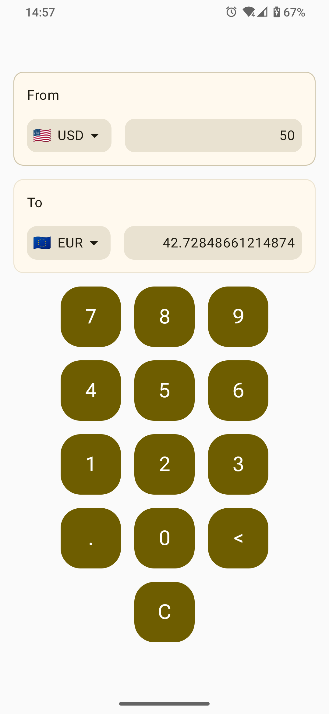

# FiatConverter

 Simple app to convert currency created with Android Compose technology
 
### Screenshots

 Light Theme

 |                                                                |                                                                | 
 |----------------------------------------------------------------|----------------------------------------------------------------|
 |  |  |
 |  |  |

Dark Theme

|                                                                |                                                                | 
|----------------------------------------------------------------|----------------------------------------------------------------|
|  |  |
|  |  |

### How to build

 1. Clone this repository
 2. Make own key to use API
    1. Visit https://unirateapi.com
    2. Register and get API key
    3. Add line `API_KEY={your api key}` in the file `local.properties`
 3. Build and install on emulator/real phone
 4. Done

### Thanks to

<a href="https://unirateapi.com">Exchange Rates By UniRateAPI</a>

## Author

 Maks Makuta  
 MIT Licence
